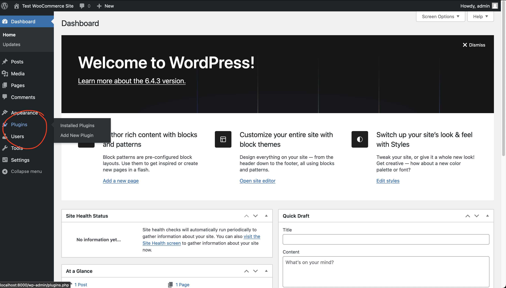
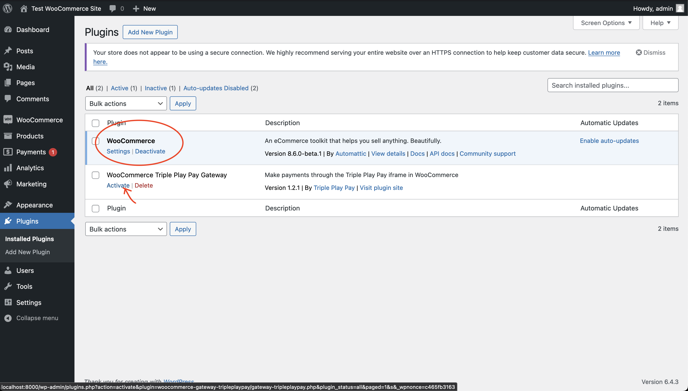
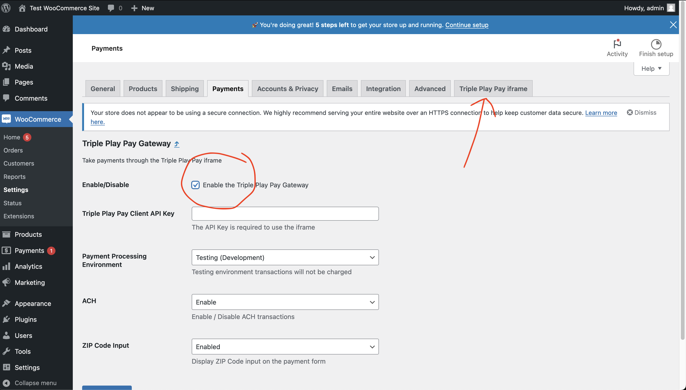
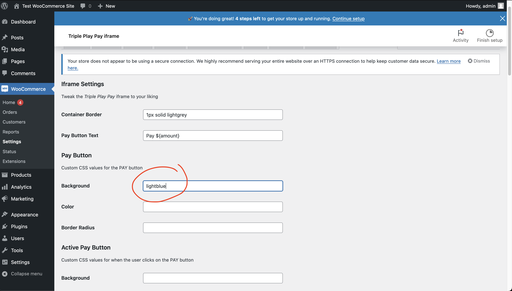
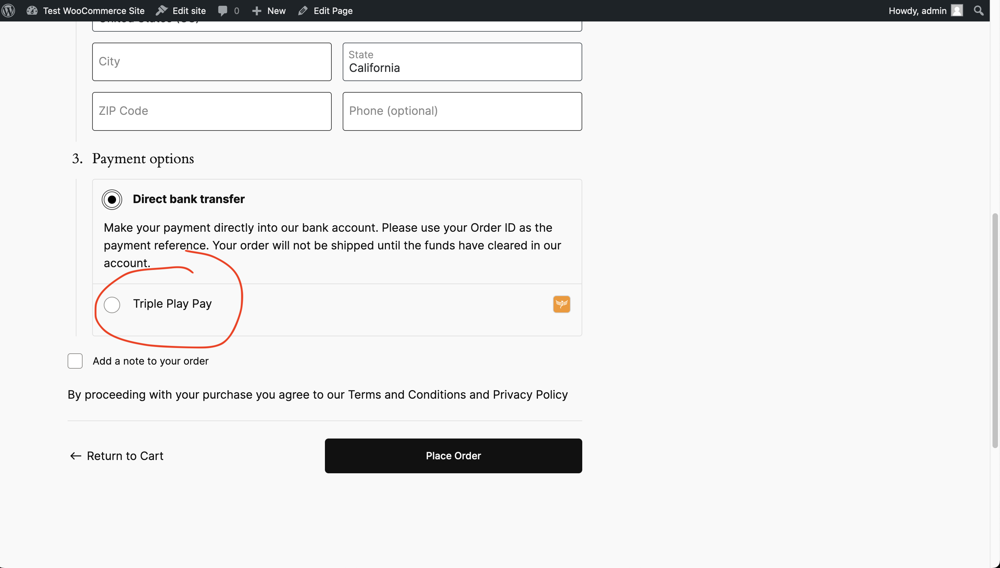
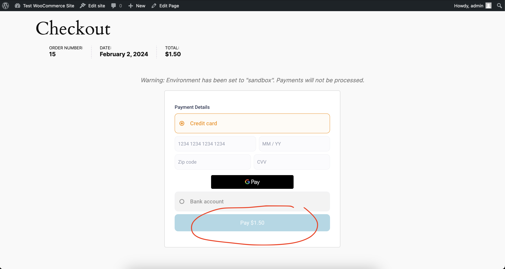

# WooCommerce Triple Play Pay Gateway

We are working on getting this plugin into the _Wordpress Plugin Store_, for now follow these instructions to install our extension:
1. Download the ZIP file from [here](https://github.com/TriplePlayPay/woocommerce-gateway-tripleplaypay/releases/tag/v1.2.1)
2. Move the ZIP file into the `wp-content/plugins` folder
3. Unzip the file
4. On the admin dashboard for Wordpress, under _Plugins_
    1. Make sure _WooCommerce_ is activated
    2. Activate the _WooCommerce Triple Play Pay Gateway_

# Features
- Credit card transactions
- Bank / ACH transfers
- Customizable appearance

# Setting Up
1. Navigate to the _Plugins_ tab in the admin dashboard

2. Make sure _WooCommerce_ is activated, then activate the _Triple Play Pay Gateway_

3. Click `settings` on the _WooCommerce Triple Play Pay Gateway_ card and Make sure to toggle `enabled` to allow the iframe as an option on your checkout page

4. To edit the looks, navigate to the `Triple Play Pay iframe` tab under WooCommerce settings

5. On the Checkout page, if you have set up other payment options, they will appear alongside the _Triple Play Pay Gateway_. Otherwise, the _Triple Play Pay Gateway_ will be the only option shown. You can use custom HTML/CSS/JS to hide this yourself if it does not fit your checkout process

6. You can see the setting we changed earlier has shown up in the iframe
